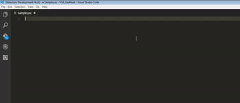

# Papyrus-Code
A VS Code package for working with Bethesda's Papyrus scripting language.

## Features

Tooling
- [X] Compilation of psc files
- [ ] Assembly of pas files
- [ ] Disassembly of pex files
- [ ] Launch online documentation

Papyrus.
- [x] Syntax Colorizer
- [x] Snippets

Papyrus Assembly
- [x] Syntax Colorizer
- [ ] Snippets

Papyrus Project
- [x] Syntax Colorizer
- [x] Snippets

## Installing
Download and install from the VS Code extension manager or [side-load](https://code.visualstudio.com/docs/extensions/yocode#_your-extensions-folder) it into VS Code.

## Extension Settings
This extension contributes the following settings. Add these to your user or workspace settings.
* `papyrus.compiler.executable`: Specifies a file path to `PapyrusCompiler.exe`.
* `papyrus.compiler.target`: Specifies a file or directory path to compile.
* `papyrus.compiler.output`: Specifies a directory path where compiled papyrus files are output.
* `papyrus.compiler.imports`: A list of import directories the papyrus compiler should use. Folders listed first override ones listed after.

## Extension Commands
* `Papyrus: Compile` The default keyboard mapping is `Ctrl` + `B`

## Known Issues
* Relative paths are not yet supported for papyrus compiler settings.
* Possibly full of bugs ;)
## Release Notes
There are no release notes at this time.

### 0.0.3
* Added `papyrus.fo4.compiler.asm` configuration.
* Added `papyrus.fo4.compiler.target` configuration.
* Added `papyrus.createproject` command, which generates a ppj using file selection.
* Added `papyrus.compiledefault` command, which compiles the psc, ppj, or folder set in `papyrus.fo4.compiler.target`, binds to `ctrl`+`shift`+`b` by default.
* Prevented extension from creating a new terminal on every compilation.
* Rewrote command names and configuration descriptions.
* Added confirmation dialog to most error messages.
* Added check to ensure that folder containing a script to be compiled is added to imports.

### 0.0.2
* Thank you for your contributions [shad0wshayd3](https://github.com/shad0wshayd3).
* Added the `const` script flag.
* Added F4SE v0.6.7 snippet support.
* Removed multiline function arguments from some snippets.
* Fixed papyrus comments.

### 0.0.1
* Changes including refactoring and reduction.

### 0.0.0
* Github Only
